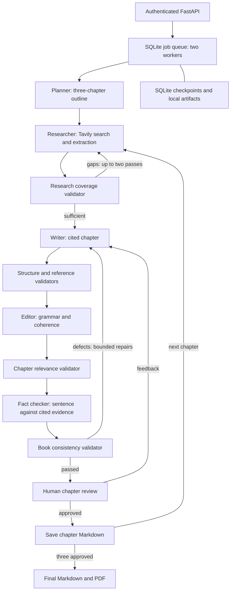

# Book Writer

A LangGraph agent researches and writes three-chapter nonfiction books from a brief. The default is **Pay Me on UPI: How Digital Payments Changed Small Business in India**, for first-time shop owners. Tavily searches and extracts source evidence; LangChain connects an OpenAI-compatible DeepSeek V4 Flash model. Dedicated validators check evidence coverage, structure, references, prose, relevance, factual support, and consistency. Each chapter contains 600–900 prose words, numbered citations, a Takeaway, and public reference links.

The API supports multiple accounts and jobs, with the UPI brief or your own book topic. Every agent prompt and research policy is configurable. Every chapter needs human approval before the next chapter starts. Rejection feedback goes through the writer and all validators again. Approved chapters download as Markdown; the final book downloads as Markdown and PDF. The included [sample book](book.md) came from a completed CLI run and received a final human copyedit for repetition and source precision.

## Run in Docker

Clone the repository with an account that has access:

```bash
gh repo clone deshwalmahesh/book-writer
cd book-writer
```

Create a private `.env` file with these values:

```dotenv
VLLM_BASE_URL=https://your-model-server/v1
VLLM_API_KEY=your-model-key
TAVILY_API_KEY=your-tavily-key
JWT_SECRET=replace-with-at-least-32-random-characters
REGISTRATION_KEY=replace-with-a-different-random-secret
```

The model server must serve `deepseek-ai/DeepSeek-V4-Flash`. Generate each secret with `python3 -c 'import secrets; print(secrets.token_urlsafe(48))'`. Keep `JWT_SECRET` stable across restarts so existing tokens remain valid. Share `REGISTRATION_KEY` only with people allowed to create accounts.

```bash
docker build -t book-writer .
docker run -d --name book-writer --restart unless-stopped \
  --env-file .env -p 127.0.0.1:8000:8000 \
  -v book-writer-data:/data book-writer
curl --fail http://127.0.0.1:8000/health
```

Open **http://127.0.0.1:8000/** for the book workspace. Create an account with your registration key, or sign in. Start the default UPI book or enter a custom title, audience and purpose under **Use a custom brief**. Pause/resume it, read each chapter, approve or request changes, and download approved chapters or the final Markdown/PDF. Status updates automatically; feedback stays in place while you read other chapters. The browser keeps its bearer token in per-tab session storage and clears it on sign-out. Tokens expire after one hour; sign in again to continue saved jobs.

The interactive API remains at **http://127.0.0.1:8000/docs**. Register with `POST /auth/register`, supplying `X-Registration-Key` and a JSON username/password. Usernames contain 3–40 ASCII letters, digits, underscores or hyphens; passwords contain 12–128 characters. Use **Authorize** with that username/password, or send the bearer token returned by `POST /auth/token` (form fields `username` and `password`).

Deploy one container with one Uvicorn process. It runs two background workflow workers, with at most 20 runnable jobs globally and three per account on creation. SQLite checkpoints and job state plus output files live in `/data`; preserve the volume across restarts. This is a single-machine deployment. For external access, put the service behind HTTPS. Additional replicas need a shared database and coordinated job claims.

## Job workflow

| Endpoint | Behavior |
| --- | --- |
| `POST /jobs` | Start the default book with no body, or send `{"brief":"Title: ...\nAudience: ...\nPurpose: ..."}` |
| `GET /jobs` | List your jobs |
| `GET /jobs/{id}` | Saved brief, status, accepted chapter count, review preview, or error |
| `POST /jobs/{id}/pause` | Request pause between graph steps |
| `POST /jobs/{id}/resume` | Queue a paused job from its checkpoint |
| `POST /jobs/{id}/review` | Approve with `{"approved":true}` or reject with `{"approved":false,"feedback":"..."}` |
| `GET /jobs/{id}/artifacts/chapter-1.md` | Download an approved chapter; also chapters 2 and 3 |
| `GET /jobs/{id}/artifacts/book.md` | Download the completed book |
| `GET /jobs/{id}/artifacts/book.pdf` | Download the completed PDF |

Poll status until `awaiting_review`, read `review_preview`, and submit a decision. `chapter_index` counts accepted chapters; `review_chapter` is zero-based. Rejections require 1–2000 characters of feedback. A chapter permits three human revision requests. A job waiting for review is already stopped; use review to continue it. Pause lets an in-flight model or search step finish, then checkpoints before the next step. On restart, previously running jobs return to the queue, paused jobs stay paused, and review decisions remain durable. A crash can repeat an unfinished external call. Memory is isolated to each job.

Other users receive 404 for your jobs and downloads. Invalid transitions return 409; invalid input returns 422. A failed job retains its accepted chapters and reports an error; create a new job after resolving the underlying configuration/provider problem. Final downloads appear only after all three approvals and successful PDF generation.

## Briefs and prompt configuration

Jobs always contain three chapters of 600–900 prose words, citations, a final Takeaway and chapter-by-chapter review. A custom brief changes the topic, audience and instructions within that format; it does not create arbitrary non-book workflows. Briefs must contain 1–20,000 nonblank characters. An optional `Title:` line is preserved by the planner. Sending no body, `{}`, or `{"brief":null}` selects the configured default.

The exact included UPI brief selects the `upi` profile. Other briefs select `general`. The default UPI model messages are unchanged. All fourteen agent roles have configurable `system` and `human` templates in [prompts.json](book_studio/prompts.json), including the planner, coverage evaluator, writer, revision/expansion helpers, editors and dedicated validators. General overrides inherit shared contracts from UPI defaults and replace topic-specific instructions.

Set `BOOK_PROMPTS_FILE` to an operator-owned JSON file. It overrides only named settings and otherwise preserves the packaged defaults. For example, restrict custom-book research to NASA and add a planning instruction:

```json
{
  "profiles": {
    "general": {
      "prompts": {
        "planner": {
          "human": "Book brief:\n{brief}\nPrefer direct explanations from primary sources."
        }
      },
      "research": { "domains": ["nasa.gov"] }
    }
  }
}
```

To change any role, copy its template from the included file and retain its named placeholders. `brief` is available in every template. No attributes, indexing, conversions or format specifications are allowed in placeholders. Unknown keys, blank prompts, missing context placeholders, malformed patterns and invalid source settings fail startup before workers launch. Retrieved text and brief values are inserted as text and are never evaluated as templates.

Each research policy accepts `domains`, three lists of `seeds` (each seed is `["https://...", "Source title"]`), three `excluded_titles` regular expressions, and two `fallback_queries` using `{title}` and `{focus}`. Empty general domains allow public HTTPS sources; an explicit domain list applies to search, seeds and the reference validator. All profiles reject private-address, credential-bearing and nonstandard-port source URLs. Source quality and factual support still go through the dedicated validators.

Mount overrides read-only rather than putting private configuration in the image:

```bash
docker run -d --name book-writer --restart unless-stopped \
  --env-file .env -e BOOK_PROMPTS_FILE=/app-config/prompts.json \
  -v "$PWD/prompts.local.json:/app-config/prompts.json:ro" \
  -v book-writer-data:/data -p 127.0.0.1:8000:8000 book-writer
```

An optional top-level `default_brief` changes the no-body preset. Overrides load at startup. Each workflow snapshots its resolved prompts and research policy when execution starts; pause, review and restart resume that snapshot, even if the operator later changes configuration. Newly started jobs use the new settings. Older checkpoints without a snapshot retain compatibility and acquire one at their next completed step. Credentials never enter prompt snapshots.

## Architecture



The UPI profile keeps extractable official NPCI, RBI, and Indian government sources. Other briefs use a topic-neutral profile with public HTTPS sources and an evidence coverage gate that selects authoritative primary material. Operators can restrict domains and supply seed pages for each chapter. The fact checker adds missing citations only when the retrieved excerpt supports the complete sentence; otherwise it removes unsupported sentences. Every repair reruns all validators. A chapter has at most four full writer attempts, three expansions per draft, two focused editor or Takeaway repairs, and 40 review cycles. Exhausting a limit fails the job rather than producing an unchecked final book.

## Project structure

| Path | Responsibility |
| --- | --- |
| `book_studio/api.py` | HTTP contracts and frontend serving |
| `book_studio/auth.py` | Argon2 passwords and expiring bearer authentication |
| `book_studio/config.py` | Environment, prompt-template and research-policy validation |
| `book_studio/prompts.json` | Included UPI prompts and neutral custom-book defaults |
| `book_studio/jobs.py` | SQLite jobs, checkpoint recovery, workers, and artifact rendering |
| `book_studio/writer.py` | Agent graph, research, writing, and dedicated validators |
| `static/` | HTML, CSS, and JavaScript workspace; no frontend build step |
| `tests/` | Real HTTP and browser integration checks |
| `book_writer.py` | Documented CLI and compatibility with earlier checkpoint class names |

Existing SQLite checkpoints remain readable after the package refactor. Keep the same `/data` volume when replacing the container. No extra database or frontend service is needed.

## Integration and browser tests

Run these against a test deployment configured with real model and Tavily credentials. Tests create accounts/jobs and preserve their artifacts. They never mock providers or delete job data. The complete UPI and custom-topic checks use provider quota; each book has a 55-minute test deadline.

```bash
python3 -m venv .venv
.venv/bin/python -m pip install -r requirements.txt -r requirements-dev.txt
PLAYWRIGHT_SKIP_BROWSER_GC=1 .venv/bin/python -m playwright install chromium
export BOOK_STUDIO_TEST_URL=http://127.0.0.1:8000
export REGISTRATION_KEY=your-test-deployment-registration-key
.venv/bin/python -m pytest --basetemp "$(mktemp -d)/run"
.venv/bin/python -m pytest --live-book --basetemp "$(mktemp -d)/run"
```

The first command checks registration/login, invalid inputs, owner isolation, pause/resume, static security headers, browser signup, keyboard submission, session expiry, offline recovery, mobile layout, and safe manuscript rendering. `--live-book` repeats the full UI workflow for both the default UPI book and a custom astronomy brief: pause/resume, retained feedback, an actual opening revision, three approvals, all five downloads, and delayed-response session/selection checks. Screenshots and downloads stay in the temporary test directory. Browser automation packages are excluded from the runtime image.

## Live end-to-end check

This check uses the running service and real configured model/Tavily calls. It creates one account and book, approves every chapter as a test reviewer, then verifies all downloads. Run with `REGISTRATION_KEY` in the environment. A full book can take many minutes and uses provider quota.

```bash
python3 - <<'PY'
import json, os, secrets, time, urllib.error, urllib.request
base = 'http://127.0.0.1:8000'
def call(path, data=None, headers=None):
    req = urllib.request.Request(base + path, data=data, headers=headers or {})
    with urllib.request.urlopen(req, timeout=30) as response:
        return response.read()
assert json.loads(call('/health'))['status'] == 'ok'
username, password = 'smoke_' + secrets.token_hex(5), secrets.token_urlsafe(24)
registration = json.dumps(dict(username=username, password=password)).encode()
for wrong_key in (None, 'wrong-invite', 'é'):
    denied_headers = {'Content-Type':'application/json'}
    if wrong_key is not None:
        denied_headers['X-Registration-Key'] = wrong_key
    try:
        call('/auth/register', registration, denied_headers)
    except urllib.error.HTTPError as error:
        assert error.code == 403, error.code
    else:
        raise AssertionError('Invalid registration key was accepted')
call('/auth/register', registration,
     {'Content-Type':'application/json', 'X-Registration-Key':os.environ['REGISTRATION_KEY']})
from urllib.parse import urlencode
token = json.loads(call('/auth/token', urlencode(dict(username=username,password=password)).encode()))['access_token']
headers = {'Authorization':'Bearer ' + token, 'Content-Type':'application/json'}
job_id = json.loads(call('/jobs', b'', headers))['id']
endpoint = '/jobs/' + job_id
deadline = time.monotonic() + 3300
while time.monotonic() < deadline:
    job = json.loads(call(endpoint, headers=headers))
    assert job['status'] != 'failed', job['error']
    if job['status'] == 'awaiting_review':
        assert 'Takeaway:' in job['review_preview']
        call(endpoint + '/review', b'{"approved":true}', headers)
    elif job['status'] == 'completed':
        break
    time.sleep(3)
else:
    raise TimeoutError('Book did not complete within 55 minutes')
for number in range(1,4):
    assert b'Takeaway:' in call(endpoint + f'/artifacts/chapter-{number}.md', headers=headers)
assert call(endpoint + '/artifacts/book.md', headers=headers).count(b'## Chapter ') == 3
assert call(endpoint + '/artifacts/book.pdf', headers=headers).startswith(b'%PDF-')
print('PASS: real HTTP, authentication, three chapter approvals, Markdown and PDF')
PY
```

## Local CLI

Use Python 3.11, install `python3 -m pip install -r requirements.txt`, and provide the same model/search configuration. The CLI automatically accepts validated chapters and writes Markdown without API review or persistence:

```bash
python3 book_writer.py --env-file /path/to/.env --output /path/to/book.md
```

Use `--brief-file /path/to/brief.txt` for another topic and `--prompts-file /path/to/prompts.json` for operator overrides. Existing output requires explicit `--overwrite`. The CLI uses the same profile selection and validation as the service.
