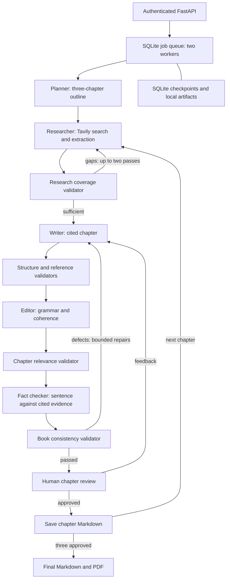

# UPI Book Writer

A LangGraph agent researches and writes **Pay Me on UPI: How Digital Payments Changed Small Business in India**, a three-chapter book for first-time shop owners. Tavily retrieves official sources; LangChain connects an OpenAI-compatible DeepSeek V4 Flash model. Dedicated validators check evidence coverage, structure, references, prose, relevance, factual support, and consistency. Each chapter contains 600–900 prose words, numbered citations, a Takeaway, and public reference links.

The API supports multiple accounts and jobs for this UPI brief. Every chapter needs human approval before the next chapter starts. Rejection feedback goes through the writer and all validators again. Approved chapters download as Markdown; the final book downloads as Markdown and PDF. The included [sample book](book.md) came from a completed CLI run and received a final human copyedit for repetition and source precision.

## Run in Docker

Clone the repository with an account that has access:

```bash
gh repo clone deshwalmahesh/upi-book-writer
cd upi-book-writer
```

Create a private `.env` file with these values:

```dotenv
VLLM_BASE_URL=https://your-model-server/v1
VLLM_API_KEY=your-model-key
TAVILY_API_KEY=your-tavily-key
JWT_SECRET=replace-with-at-least-32-random-characters
REGISTRATION_KEY=replace-with-a-different-random-secret
```

The model server must serve `deepseek-ai/DeepSeek-V4-Flash`. Generate each secret with `python3 -c 'import secrets; print(secrets.token_urlsafe(48))'`. Keep `JWT_SECRET` stable across restarts so existing tokens remain valid. Share `REGISTRATION_KEY` only with people allowed to create accounts.

```bash
docker build -t upi-book-writer .
docker run -d --name upi-book-writer --restart unless-stopped \
  --env-file .env -p 127.0.0.1:8000:8000 \
  -v upi-book-data:/data upi-book-writer
curl --fail http://127.0.0.1:8000/health
```

Open **http://127.0.0.1:8000/docs** for the interactive API. Register with `POST /auth/register`, supplying `X-Registration-Key` and a JSON username/password. Usernames contain 3–40 ASCII letters, digits, underscores or hyphens; passwords contain 12–128 characters. Use **Authorize** with that username/password, or send the bearer token returned by `POST /auth/token` (form fields `username` and `password`). Tokens expire after one hour; log in again to continue a long job.

Deploy one container with one Uvicorn process. It runs two background workflow workers, with at most 20 runnable jobs globally and three per account on creation. SQLite checkpoints and job state plus output files live in `/data`; preserve the volume across restarts. This is a single-machine deployment. For external access, put the service behind HTTPS. Additional replicas need a shared database and coordinated job claims.

## Job workflow

| Endpoint | Behavior |
| --- | --- |
| `POST /jobs` | Start the built-in UPI book; no request body |
| `GET /jobs` | List your jobs |
| `GET /jobs/{id}` | Status, accepted chapter count, review preview, or error |
| `POST /jobs/{id}/pause` | Request pause between graph steps |
| `POST /jobs/{id}/resume` | Queue a paused job from its checkpoint |
| `POST /jobs/{id}/review` | Approve with `{"approved":true}` or reject with `{"approved":false,"feedback":"..."}` |
| `GET /jobs/{id}/artifacts/chapter-1.md` | Download an approved chapter; also chapters 2 and 3 |
| `GET /jobs/{id}/artifacts/book.md` | Download the completed book |
| `GET /jobs/{id}/artifacts/book.pdf` | Download the completed PDF |

Poll status until `awaiting_review`, read `review_preview`, and submit a decision. `chapter_index` counts accepted chapters; `review_chapter` is zero-based. Rejections require 1–2000 characters of feedback. A chapter permits three human revision requests. A job waiting for review is already stopped; use review to continue it. Pause lets an in-flight model or search step finish, then checkpoints before the next step. On restart, previously running jobs return to the queue, paused jobs stay paused, and review decisions remain durable. A crash can repeat an unfinished external call. Memory is isolated to each job.

Other users receive 404 for your jobs and downloads. Invalid transitions return 409; invalid input returns 422. A failed job retains its accepted chapters and reports an error; create a new job after resolving the underlying configuration/provider problem. Final downloads appear only after all three approvals and successful PDF generation.

## Architecture



`book_writer.py` owns the graph and quality rules. `jobs.py` owns durable jobs, bounded execution, and artifact rendering. `api.py` owns authentication and HTTP contracts. Research keeps extractable official NPCI, RBI, and Indian government sources. The fact checker adds missing citations only when the retrieved excerpt supports the complete sentence; otherwise it removes unsupported sentences. Every repair reruns all validators. A chapter has at most four full writer attempts, three expansions per draft, two focused editor or Takeaway repairs, and 40 review cycles. Exhausting a limit fails the job rather than producing an unchecked final book.

## Live end-to-end check

This check uses the running service and real configured model/Tavily calls. It creates one account and book, approves every chapter as a test reviewer, then verifies all downloads. Run with `REGISTRATION_KEY` in the environment. A full book can take many minutes and uses provider quota.

```bash
python3 - <<'PY'
import json, os, secrets, time, urllib.error, urllib.request
base = 'http://127.0.0.1:8000'
def call(path, data=None, headers=None):
    req = urllib.request.Request(base + path, data=data, headers=headers or {})
    with urllib.request.urlopen(req, timeout=30) as response:
        return response.read()
assert json.loads(call('/health'))['status'] == 'ok'
username, password = 'smoke_' + secrets.token_hex(5), secrets.token_urlsafe(24)
registration = json.dumps(dict(username=username, password=password)).encode()
for wrong_key in (None, 'wrong-invite', 'é'):
    denied_headers = {'Content-Type':'application/json'}
    if wrong_key is not None:
        denied_headers['X-Registration-Key'] = wrong_key
    try:
        call('/auth/register', registration, denied_headers)
    except urllib.error.HTTPError as error:
        assert error.code == 403, error.code
    else:
        raise AssertionError('Invalid registration key was accepted')
call('/auth/register', registration,
     {'Content-Type':'application/json', 'X-Registration-Key':os.environ['REGISTRATION_KEY']})
from urllib.parse import urlencode
token = json.loads(call('/auth/token', urlencode(dict(username=username,password=password)).encode()))['access_token']
headers = {'Authorization':'Bearer ' + token, 'Content-Type':'application/json'}
job_id = json.loads(call('/jobs', b'', headers))['id']
endpoint = '/jobs/' + job_id
deadline = time.monotonic() + 3300
while time.monotonic() < deadline:
    job = json.loads(call(endpoint, headers=headers))
    assert job['status'] != 'failed', job['error']
    if job['status'] == 'awaiting_review':
        assert 'Takeaway:' in job['review_preview']
        call(endpoint + '/review', b'{"approved":true}', headers)
    elif job['status'] == 'completed':
        break
    time.sleep(3)
else:
    raise TimeoutError('Book did not complete within 55 minutes')
for number in range(1,4):
    assert b'Takeaway:' in call(endpoint + f'/artifacts/chapter-{number}.md', headers=headers)
assert call(endpoint + '/artifacts/book.md', headers=headers).count(b'## Chapter ') == 3
assert call(endpoint + '/artifacts/book.pdf', headers=headers).startswith(b'%PDF-')
print('PASS: real HTTP, authentication, three chapter approvals, Markdown and PDF')
PY
```

## Local CLI

Use Python 3.11, install `python3 -m pip install -r requirements.txt`, and provide the same model/search configuration. The CLI automatically accepts validated chapters and writes Markdown without API review or persistence:

```bash
python3 book_writer.py --env-file /path/to/.env --output /path/to/book.md
```

Existing output requires explicit `--overwrite`. The research and validation rules are specific to the UPI book even when `--brief-file` overrides wording of the brief.
